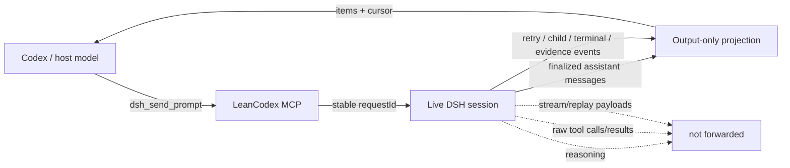
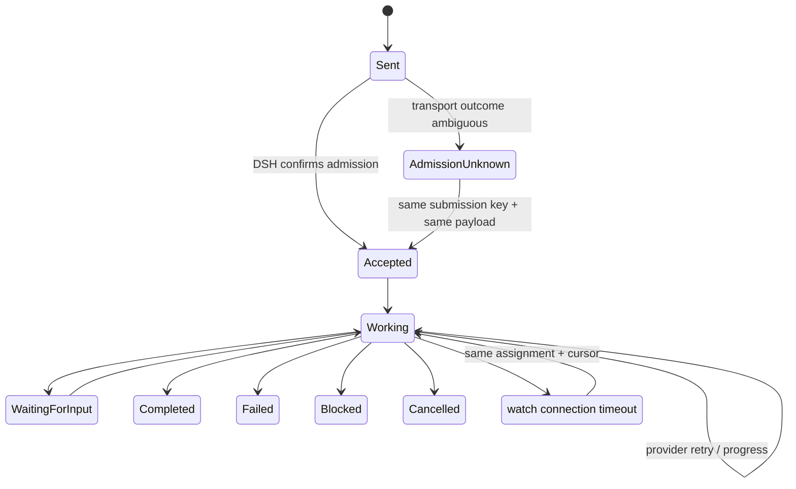

<div align="center">

# LeanCodex

### Keep Codex focused on decisions. Let DeepSeek Harness handle the long-running work.

[](https://github.com/ShehabYahya/LeanCodex/releases)
[](https://github.com/ShehabYahya/LeanCodex/actions)


**Send work once. Follow the exact assignment. Receive only finalized outward output. Resume safely after timeouts.**

</div>

---

LeanCodex is a Codex plugin + MCP server for working with an already-running [DeepSeek Harness](https://github.com/deepseek-ai/deepseek-harness) session without scraping giant transcripts or polling with ad-hoc scripts.

It gives the host a durable assignment handle, a resumable cursor, compact lifecycle state, and bounded evidence reads. The plugin deliberately keeps DSH's internal reasoning and raw tool traffic out of the normal model-visible feed.

## Why this exists

Long-running agent sessions are useful, but supervising them from another model gets expensive fast if every check means rereading large transcripts, logs, diffs, or tool traces.

LeanCodex turns that into a small stateful interface:



### What you get

| Capability | What it means |
| --- | --- |
| **Exact assignment correlation** | Responses are tied to DSH's native request identity, not prompt-prefix guessing. |
| **Incremental output** | Read only what appeared after your last cursor. |
| **Lossless resume** | Large messages are chunked and resumable with signed cursors. |
| **Timeout-safe observation** | A watcher timeout does not magically become task failure. |
| **Retry-safe admission** | Ambiguous send outcomes preserve the same assignment/request identity. |
| **Compact lifecycle signals** | Retry, waiting-for-input, child state, completion, failure, blocking, cancellation, and evidence remain distinct. |
| **Bounded evidence reads** | Read only assignment-owned published messages/files instead of arbitrary large paths. |
| **Local-only transport** | DSH credentials stay local; non-loopback DSH endpoints are refused. |

## Quick start

### 1. Prerequisites

- Python 3.11+
- a local DeepSeek Harness web session
- Codex / ChatGPT Desktop with plugin support
- the local DSH service available at `http://127.0.0.1:3080` unless you configure another loopback address

### 2. Add this repository as a plugin marketplace

```bash
codex plugin marketplace add ShehabYahya/LeanCodex
```

Then restart ChatGPT Desktop, open the plugin directory, select the marketplace, and install **LeanCodex**.

This repository follows the Codex marketplace layout in `.agents/plugins/marketplace.json`. See the official OpenAI plugin packaging guide for the current marketplace flow: https://developers.openai.com/plugins/build/plugins

### 3. Use it naturally

Examples:

```text
Use my running DSH session to work on this.
```

```text
Send this prompt to the DSH session and show me new output as it arrives.
```

```text
Resume the assignment from the last cursor.
```

The `dsh-cli-session` skill exposes the session interface and its technical semantics. The companion [dsh-orchestrator skill](plugins/dsh-cli-session/skills/dsh-orchestrator/SKILL.md) provides a workflow for engineering delegation: the host retains architecture, scope, and review while DSH handles bounded assignments.

```text
Use $dsh-orchestrator to implement this with DSH workers while you guide the architecture and review the result.
```

The companion skill uses the same MCP tools, waits on the exact assignment, and reads evidence selectively. It does not change model settings or add instructions to the MCP server. Simple inspection and verbatim prompt relay still use `dsh-cli-session`.

For a personal default across repositories, add a short routing instruction to your global `~/.codex/AGENTS.md` after installing the skill:

```text
For engineering work delegated to DSH, read and follow dsh-orchestrator before
dispatching work. Keep architecture, scope, acceptance, and final review with
the host; delegate bounded execution to DSH. Respect explicit requests for
direct work or simple prompt relay.
```

Global routing selects the workflow in future sessions; it does not authorize unrelated work or override a user's task-specific direction.

## Tool surface

| Tool | Purpose |
| --- | --- |
| `dsh_list_sessions` | List a bounded page of local DSH sessions. |
| `dsh_inspect_session` | Inspect one exact session or recover compact state for an assignment. |
| `dsh_send_prompt` | Send a prompt with durable request correlation. |
| `dsh_wait_output` | Wait for new finalized output/lifecycle events. Read-only. |
| `dsh_read_evidence` | Read a bounded continuation of assignment-owned output or a published file. |
| `dsh_add_project` | Register an existing local project/workspace. |
| `dsh_new_session` | Create a DSH session. |

## Failure handling



A connection timeout while **watching** does not mark the assignment failed. A timeout while **sending** may return `admission_unknown`, because DSH may already have accepted the prompt; retrying the same logical submission uses the same `submission_key` and payload.

## Output contract

The normal feed includes:

- finalized outward assistant text;
- compact provider-retry state;
- waiting-for-input / resolved state;
- child/workflow lifecycle signals;
- published evidence references;
- terminal execution state.

The normal feed excludes:

- internal reasoning;
- raw tool calls;
- raw tool results;
- transient assistant stream/replay payloads;
- raw provider failure messages.

Unknown future assistant content types fail closed as compact `unsupported_content` signals instead of dumping opaque payloads.

## Security model

- DSH endpoints must resolve to loopback: `127.0.0.1`, `localhost`, or `::1`.
- Browser-session credentials are read locally from DSH state and are never accepted as MCP tool arguments.
- Cursor tokens are HMAC-signed and assignment-bound.
- Evidence reads are assignment-owned and bounded.
- Published relative artifact paths are revalidated; current symlinks are refused.
- Local assignment correlation state uses private file permissions where supported.

## Compatibility and limits

The adapter was implemented against the public DeepSeek Harness contract documented in [`docs/NATIVE_CONTRACT.md`](docs/NATIVE_CONTRACT.md). Unsupported or missing observations are reported rather than fabricated.

The compatibility baseline is **wait-based delivery through ordinary MCP tool results**. This project does not claim that unsolicited MCP push wakes the host model or injects content into model context without a tool call.

## Development

Run the deterministic test suite:

```bash
python3 -m unittest -v tests/test_supervision.py
```

Verify the real MCP stdio contract:

```bash
python3 tests/test_mcp_stdio.py
```

The test suite does not require paid model/provider calls.

## Documentation

- [Native DSH contract](docs/NATIVE_CONTRACT.md)
- [Migration notes](docs/MIGRATION.md)
- [Changelog](CHANGELOG.md)
- [Contributing](CONTRIBUTING.md)
- [Security](SECURITY.md)

## Release

**v1.0.3** is the first release under the **LeanCodex** name. It keeps the existing `dsh-cli-session` compatibility surface while updating the public brand and release plumbing.

See [the v1.0.3 release notes](docs/releases/v1.0.3.md).

---

<div align="center">

Built for people who want the host model to stay focused on decisions while the session plumbing stays small, durable, and observable.

</div>
